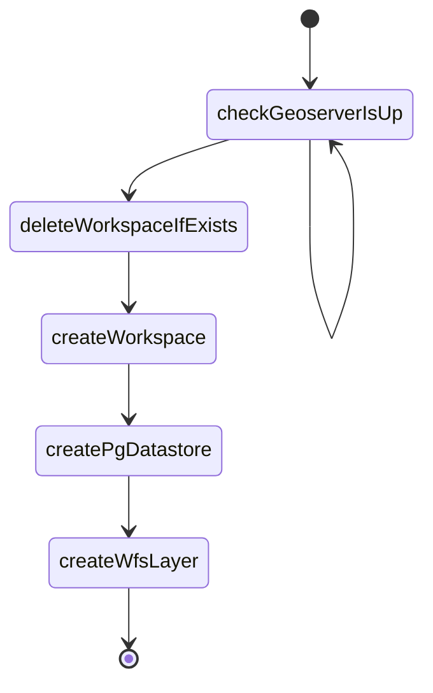

# Initial layer configuration with Side-car
[home](../README.md)
* This Side-car's goal is to run over new geoserver and auto-generate layer that will serve entire suite of polygon parts features via WFS.
* It Watches geoserver REST-API endpoint availability and once detect so, process will be start.
* Implemented with Nodejs and use fetch requests on several geoserver's rest APIs [/rest](https://docs.geoserver.org/main/en/user/rest/index.html).
* Supports Javascript.

## Main processes



> [!IMPORTANT]
> Layer properties use static [artifact json file](../artifacts/README.md) that include relevant properties, attributes, mappings and etc..

<br>

## Environment Variables for configuration
| Variable | What is it | Mandatory   | Default |
| :---:   | :---: | :---: | :---: |
| GEOSERVER_USER | geoserver admin user name | - | admin |
| GEOSERVER_PASS | geoserver admin password name | - | geoserver |
| DATA_STORE_HOST | postgres server endpoint | + | - |
| DATA_STORE_PORT | postgres server port | - | 5432 |
| DATA_STORE_DATABASE | db name | - | polygon_parts |
| DATA_STORE_USER | postgres server user name | - | postgres |
| DATA_STORE_PASSWORD | postgres server password | - | postgres |
| DATA_STORE_DBTYPE | data store type in geoserver | - | postgis |
| DATA_STORE_SCHEMA | postgres schema name | - | polygon_parts |
| DATA_STORE_SSL | should connect to postgres with ssl | - | DISABLED |
| DATA_STORE_NAME | data store name | + | polygon_parts |
| GEOSERVER_BASE_URL | Endpoint of geoserver  | - | http://localhost:8080/geoserver |
| POLYGON_PARTS_WORKSPACE_NAME | workspace name | - | polygon_parts |
| MAX_FEATURES | limit the number of feature to receive | - | 10 |
| NUM_DECIMALS | limit the number accuracy | - | 10 |
| LAYER_TITLE_NAME | layer internal name | - | polygon_parts |
| LOG_LEVEL | minimum log level to be printing | - | info |
| LOG_PRETTY | print pretty the log - only for development | - | FALSE |

## USAGE

### Local
1. Install the package using the following command:
   
```bash 
npm i 
 ```

2. Run script.
 ```bash
npm run start
```

> [!TIP]
> add to src folder ".env" file and insert local Environment Variables list (KEY=value) instead setting the variable per OS.

